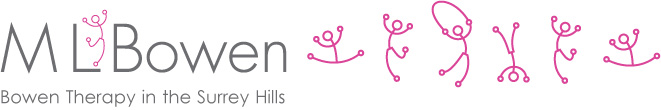

#  <span style="color:#da4699"> Milestone Project 1 </span>

[](www.mlbowen.com)

***

# ML Bowen Website (www.mlbowen.com) 


## Background Description

This website has been build for a Bowen Therapist as part of a marketing campaign to :<br>

* Promote the treatment service
* Provide information about Bowen Therapy
* Build confidence in the therapist
* Provide booking information for prospective patients


## 1. UX
"Lorem ipsum dolor sit amet, consectetur adipiscing elit, sed do eiusmod tempor incididunt ut labore et dolore magna aliqua. Ut enim ad minim veniam, quis nostrud exercitation ullamco laboris nisi ut aliquip ex ea commodo consequat. <br><br>Duis aute irure dolor in reprehenderit in voluptate velit esse cillum dolore eu fugiat nulla pariatur. Excepteur sint occaecat cupidatat non proident, sunt in culpa qui officia deserunt mollit anim id est laborum."

## 2. Features


> ### 2.1 Existing Features

> ### 2.2 Features Left to Implement


## 3. Technologies Used

Here is some code `<p></p>`

This is a code block 
```<body>
    <div class="title">Milestone Project 1</div>
    <p>Hello Kieron to your new world !!</p>
</body>
```


## 4. Testing


## 5. Deployment


## 6. Credits


> ### 6.1 Content

> Code | Source| Comment
> :--- | :---- | :---
> 1. CSS to do this in this line adsasd hkahd hkadh  kahd a kjhad  | www.w3schools.com|Hi there
> 2. Code for this and that| from this source B
> 3. Code for this and that|from source A


> ### 6.2 Media


> ### 6.3 Acknowledgements


